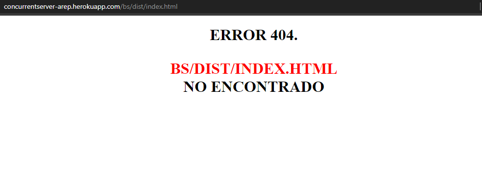

# Concurrencia en servidores Http con Sockets Java

En el siguiente repositorio se muestra la implementación de un servidor HTTP en Java usando Sockets con el objetivo de simular el funcionamiento de un servidor real, el cual es capaz de retornar elementos de tipo html, css y javascript, incluyendo imagenes.

### Prerrequisitos

Para ejecutar con éxito este programa se requiere de los siguientes programas instalados en su máquina.

```
java version: "1.8.0_171"
git version: 2.19.1.windows.1
Apache Maven version: 3.6.3
Apache JMeter version: 5.3 (Opcional)
```

## Instrucciones de uso

Si quiere probar la ejecución del servidor de manera web puede acceder al siguiente enlace:  [Heroku](https://concurrentserver-arep.herokuapp.com/colorsApp/inicio.html) .

Para poder usar el proyecto de manera local lo primero que debe realizar es clonar este repositorio utilizando el siguiente comando desde la terminal del S.O que este utilizando:

```
git clone https://github.com/EdKillah/ConcurrentServer-AREP
```
Otra alternativa es descargarlo directamente por formato ZIP en el botón que indica **"Clone or Download".**
Luego debe redirigirse por medio de la terminal al directorio raíz la cual contiene el achivo pom.xml.

Una vez se encuentre en este directorio se debe compilar el programa para esto se debe ejecutar el siguiente comando:

```
mvn package
```

Una vez compilado el proyecto se encuentra en posibilidad de probar los siguientes ejercicios:

### APLICACIONES DEL SERVIDOR

 Realizar peticiones concurrentes en el servidor

#### Comando para ejecutar:
```
java -cp target/TallerNetworking-1.0-SNAPSHOT.jar edu.escuelaing.arep.http.services.HttpServer
```

Una vez ejecutado el comando se debe ir al navegador de preferencia y entrar a la dirección **localhost:32000/index.html** para ver una página html con imagenes por defecto. 
En cambio, si desea puede jugar con la siguiente aplicación implementada por mí llamada: **Colors App** a la que puede acceder yendo a la dirección: **localhost:32000/colorsApp/inicio.html**
o accediendo al siguiente enlace: 

 [Colors App](https://concurrentserver-arep.herokuapp.com/colorsApp/inicio.html) - Aplicación implementada en JS.

 

### Cómo jugar "Colors App":
**Colors App es una aplicación pequeña con persistencia implementada en javascript vanilla, la cual consiste en memorizar el patrón de colores que aparezca en la pantalla y replicarlo para poder avanzar de nivel.**

1. primero se encontrara en la ventana de inicio en la que tiene dos opciones:
	* jugar 
	* ver tabla de posiciones
	
	
2. Tabla de posiciones: 
	* se muestra la tabla ordenada del mejor puntaje al peor, esta tabla es en tiempo real por lo que una vez terminada su partida puede ver su puntaje.
	
	
3. Jugar: 
	* Para jugar debe introducir un nickname y darle en aceptar.
	
	* Lo siguiente es darle en play donde **la pantalla cambiará de color** y usted debe oprimir el color correspondiente en los cuadros de abajo. A medida que avance de ronda la cantidad de colores a memorizar aumenta junto con la velocidad.
	
	
	* ***Detalles***: 
		* En la parte inferior izquierda (flecha roja) se encuentra su puntaje actual.
		* En la parte inferior derecha (flecha azul) se encuentra la cantidad de veces que ha oprimido los botones de abajo.


### Imagenes de muestra del servidor

#### Html5 básico
La siguiente imagen muestra una lectura de texto plano que proviene de un codigo *javascript*.


#### Imagenes.
A continuación se presenta una página html sencilla incluyendo **css** y unas imagenes demostrando su funcionalidad correcta al tener diferentes formatos **(JPG & PNG).**


#### Página de error sencilla




## Diagrama de clases

La siguiente imagen muestra los diagramas de clases que permiten la interacción entre el servidor y las clases encargadas de la lectura de archivos solicitados por el cliente, la forma de construcción se detalla en el archivo pdf.


## Pruebas de ejecución con Apache JMeter

Como se indicó en los prerrequisitos se hará uso del programa JMeter ofrecido por apache para poder realizar pruebas de peticiones a servidores de manera concurrente para comprobar su funcionamiento y eficiencia.
Para esta ocasión se dará por sentado que ya se tiene instalado JMeter en su equipo y se procederá a mostrar un pequeño tutorial de como se realizan las pruebas al servidor que se trata en este repositorio.

Lo primero que se debe hacer es prender el servidor (Este paso se encuentra en las instrucciones de uso en la parte superior) O si lo desea se puede probar la aplicación desplegada en **Heroku**.

Luego en JMeter debe dirigirse a la parte superior izquierda y dar click derecho en el botón TestPlan y seguir los pasos como se muestra en la imagen, una vez creada la clase escogeremos

 - el número de peticiones  
 -  el tiempo en segundos que tardará en
   realizar las peticiones .
-    Y las veces que se realizarán.


Luego se añadirá un HttpRequestDefault y un HttpRequest para que reciba las peticiones raíz y algún recurso en especifico. En este caso usamos la dirección de heroku en la que se encuentra desplegada la aplicación. 
https://concurrentserver-arep.herokuapp.com/ y usamos los recursos 
* index.html
* colorsApp/inicio.html
* colorsApp/index.html


Ahora procederemos a escoger los diferentes Listeners que ofrece JMeter para analizar la información de manera amigable


Resultados en forma de arbol


Resultados en forma de tabla


## Construido con


* [Maven](https://maven.apache.org/) - Dependency Management
* [JMeter](https://jmeter.apache.org/) - Load test functional behavior
* [Java](https://www.java.com/es/download/) - Lenguaje de programación
* [Git](https://github.com/) - Versionamiento


## Authors

* **Eduard Jimenez** 
*  Fecha: 27/08/2020


## Licencia

This project is licensed under the MIT License - see the [LICENSE](LICENSE) file for details

### Enlace al sistema de integración continua

A continuación se presenta el link:
[](https://circleci.com/gh/EdKillah/ConcurrentServer-AREP)
